## 1. 到自己 google 帳號去設定 GAS 並且複製自己的網址、API key

1. 到自己 google 帳號建立空白 excel(這個就是你儲存資料的地方了)
2. 點擊"擴充功能">"AppsScript"
   1. 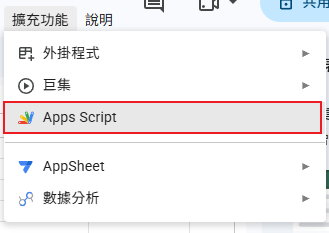
3. 複製 "Code.gs" 到 "程式碼.gs" 去貼上
   1. 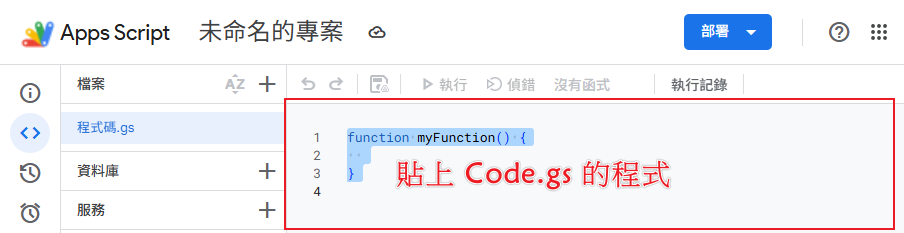
4. 點擊部屬的下拉選單選中"新增部屬作業"
   1. 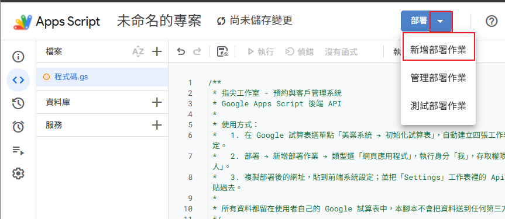
5. 看到部屬視窗後點擊"設定齒輪圖">"網頁應用程式"
   1. 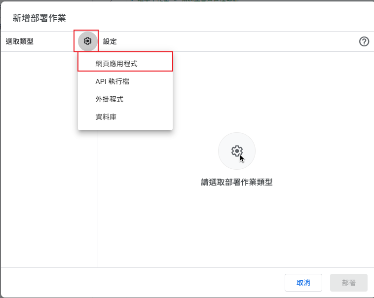
6. 請在 誰可以存取 選擇 "所有人"、然後點擊"部屬"
   1. 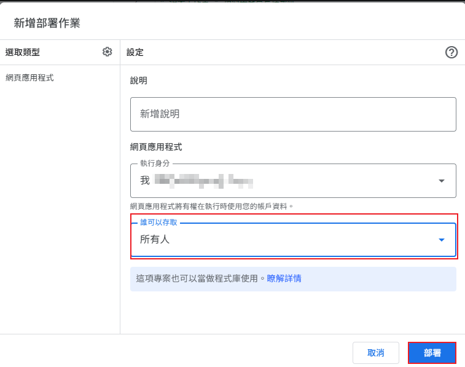
7. 後點擊 "授予存取權"
   1. 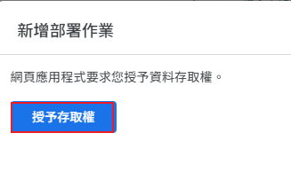
8. 因為要授予存取權還會要你做驗證

   | 中文版 | 英文版 |
   | :--- | :--- |
   | 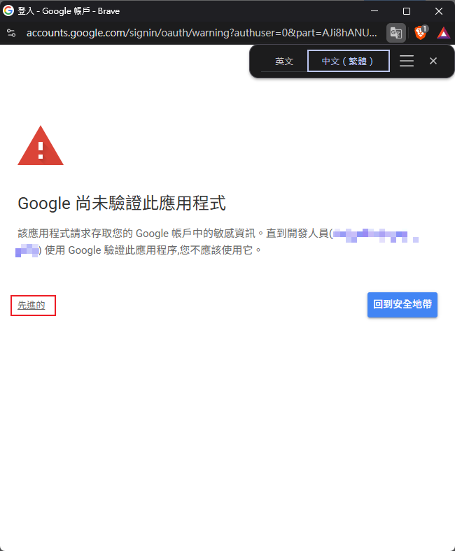| 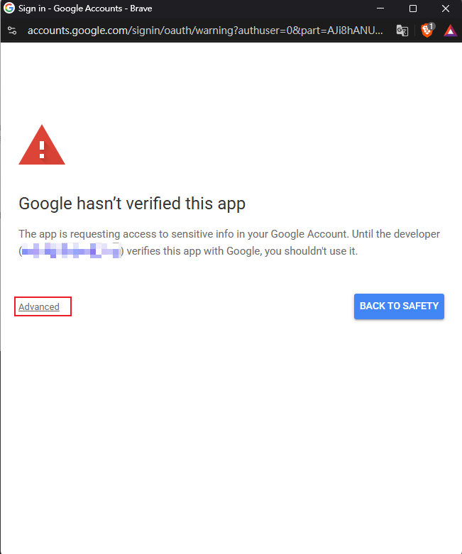|
   | 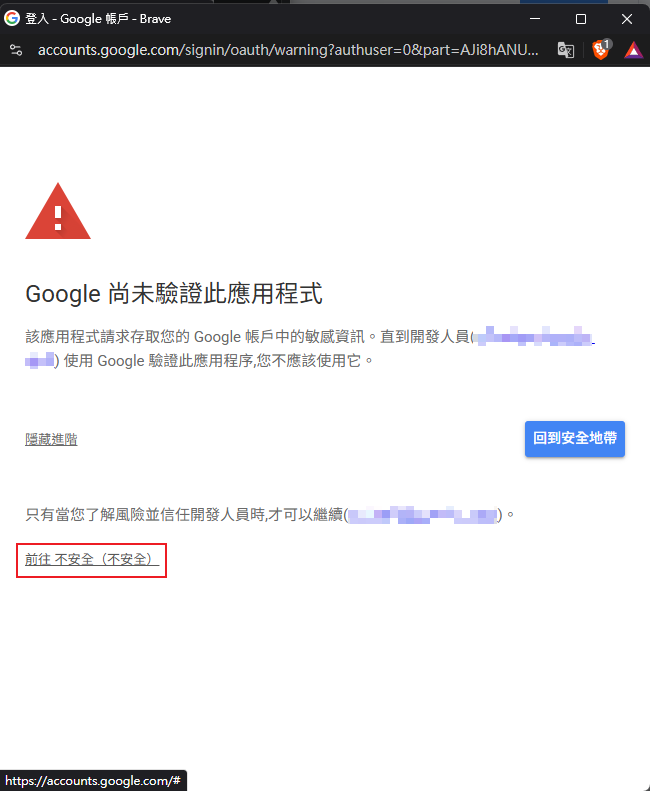| 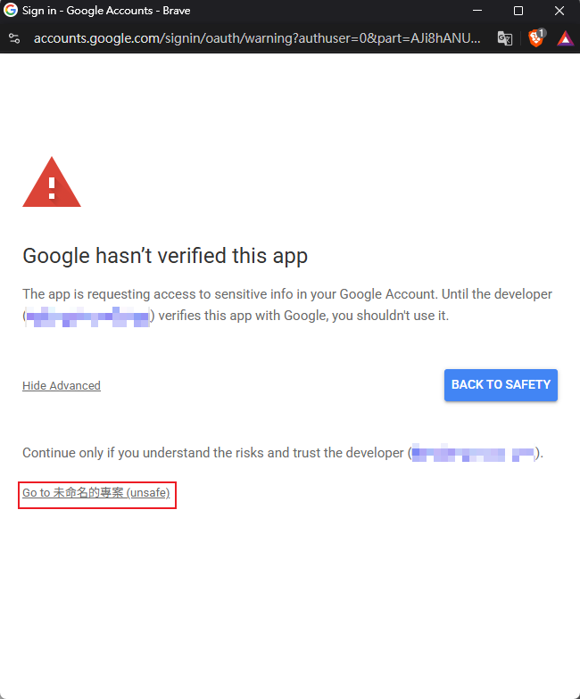|

9. 點擊 "繼續"或是"Continue"
   1. 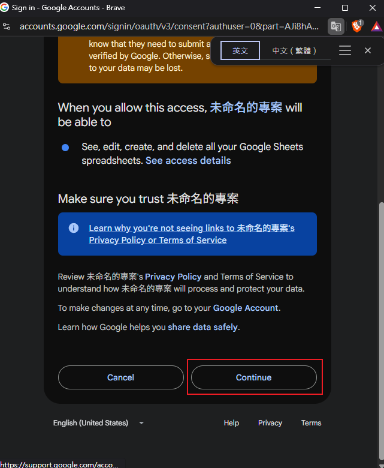
10. 複製你的"網頁應用程式網址" (後續在網頁上會用到)
    1. 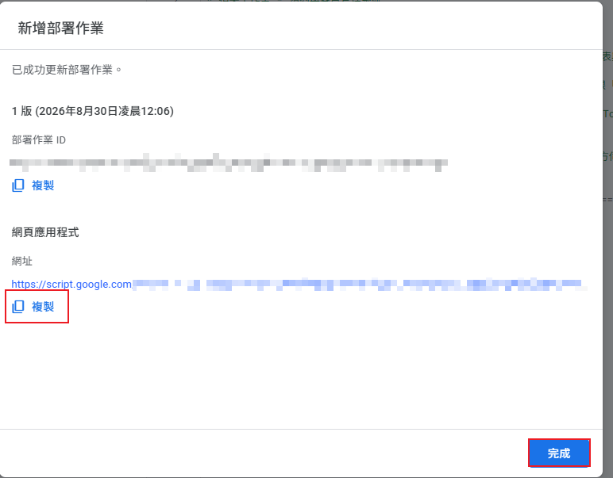
11. 如果忘記了回頭也可以在這邊找到
    1. 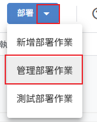
    2. 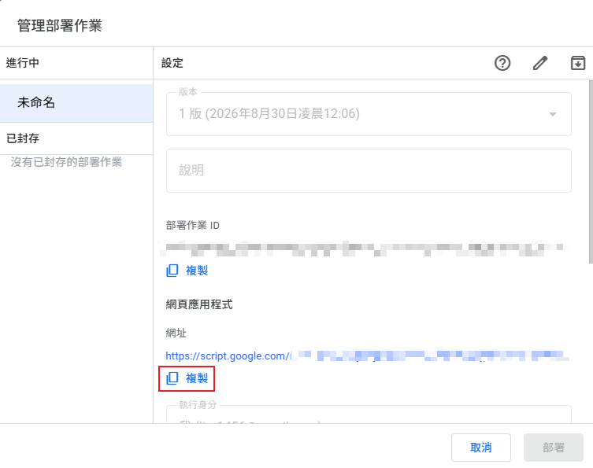
12. 回到你的 Excel 後重新整理
    1. 就會發現多一個"美業系統" 可以做點擊
    2. 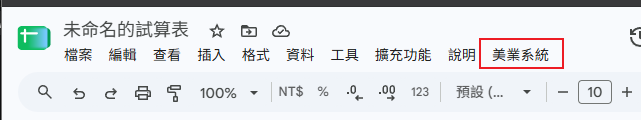
13. 就可以點擊 "初始化試算表"、後續點"確定"
    1. 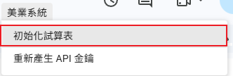
    2. 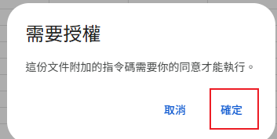
14. 一樣去做驗證
    1. 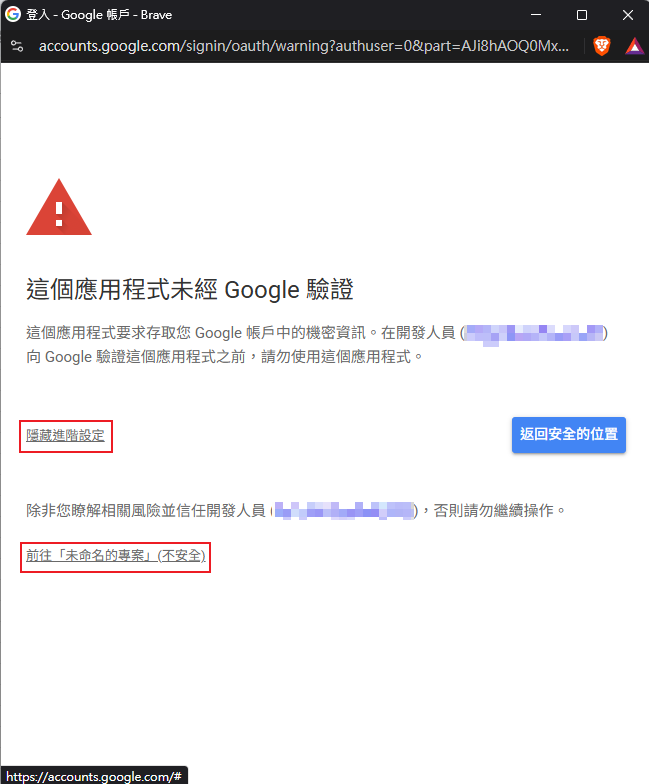
    2. 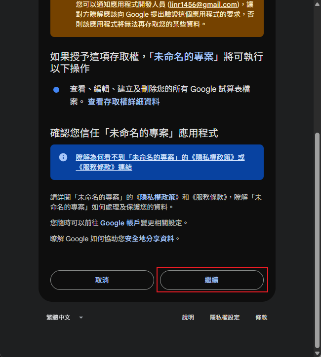
15. 就會出現"初始化完成通知"
    1. 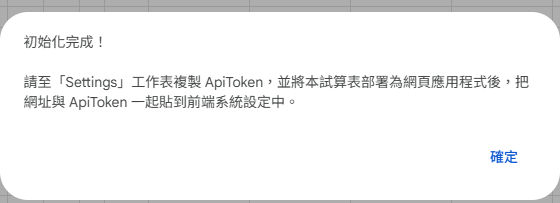
    2. 可以把原本預設的頁籤刪除沒關係~(不刪也可以)
       1. 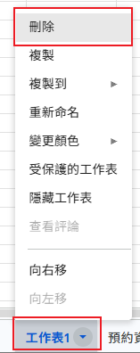
16. 到"系統設定"頁籤，複製 "API 金鑰"
    1. 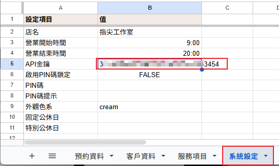

## 2. 在網頁裡貼上環境資訊"網頁應用程式網址"、"API 金鑰"
| 電腦 | 平板、手機 |
   | :--- | :--- |
|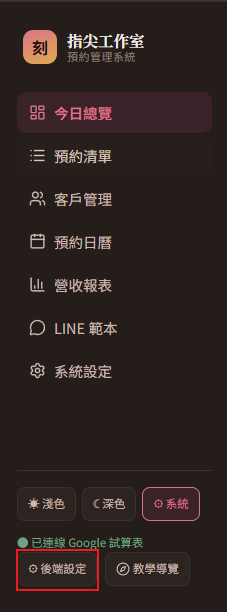 | 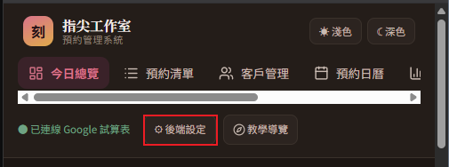

---
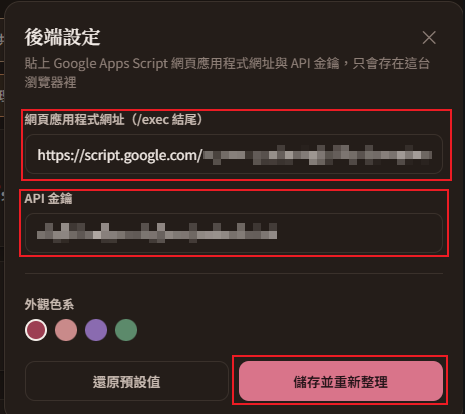

## 3.做點教學才會上手
透過新手導覽等方式跟操作教學就會知道怎麼做喔~
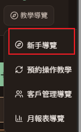

### 小撇步(小小知識讓你可以更順手應用)
#### 1. 一開始都會很擠很小填入資料後就可以去調整

| 調整前 | 調整後 |
| :--- | :--- |
| 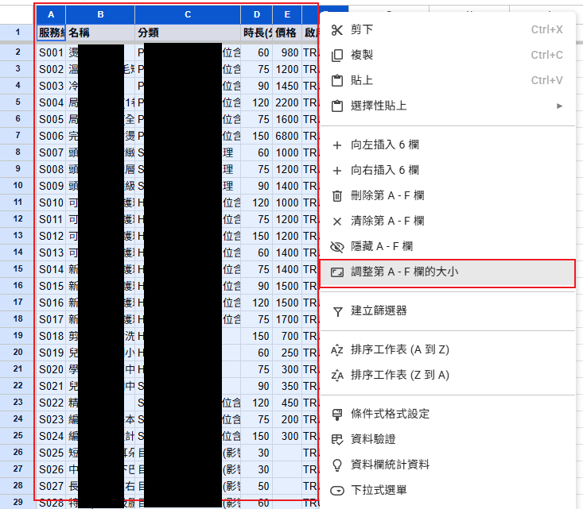| 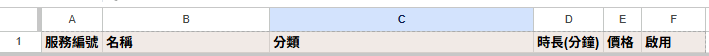|

#### 2. 可以隨意編輯自己的 Excel 名稱、專案名稱
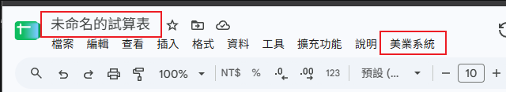
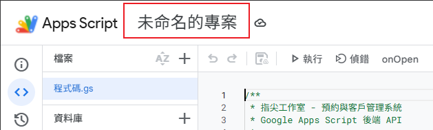

#### 3. 錯誤資訊對應

- 發現 API 金鑰錯誤請檢查或是重新產生 API key

- "重新產生 API key"解決方法
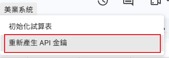
也會同時更新系統設定裡的API金鑰
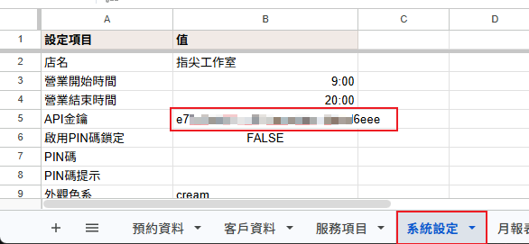

### QA

#### 話說 API金鑰會過期嗎?
>不會自動過期
>除非您在 Google 試算表選單點「美業系統 → 重新產生 API 金鑰」
>才會產生一組新的隨機金鑰覆蓋掉舊的——舊金鑰在那之後就立刻失效了
>前端要記得同步更新新的金鑰才能繼續使用。